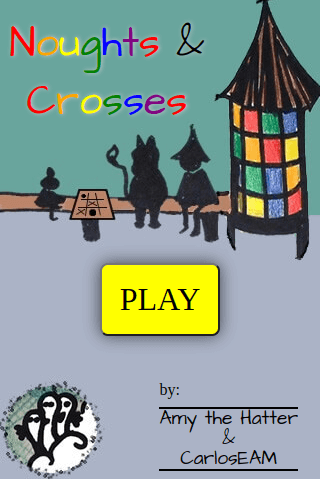
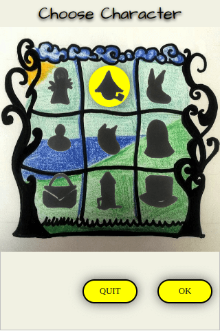
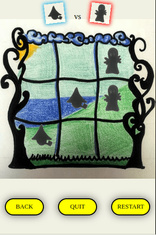

# tic-tac-toe-moomins-edit :video_game:

Classic tic tac toe game but instead of using X and O you use Moomin characters to play with and against.

## About :pushpin:

I built this game just to practice Vanilla JS and CSS.
It was created a while ago and just went through it to refactor the code and things have changed a lot. Updated it to use `querySelector`, `let`, `const` and toggle class names to use CSS for the animations instead of using inline styles.

The computer has no easy or hard mode. It is always trying to win, although the logic needs improving.

## Future Features

There are a couple of features I want to add.

- Check the computer moves logic and improve. _2nd iteration_
- Randomise which players starts the game. Currently the computer always goes second.
- Add a scoring system
- Option for a second human player
- Make it into a react project

## Getting started

Run a local server to load this file or open it with any browser.

- No dependencies
- No plugins
- Just open the page on the browser and off you go!

## Built with

- HTML
- CSS
- Javascript

## Contributing

Pull requests are welcomed.

- Fork the repo
- Clone locally or not ^-^
- Create your changes
- Make a pull request

## Authors

- [Amy Louise Sutton](https://amythehatter.com) - images designer
- [Carlos E Alford M](https://carlosealford.com) - app developer
